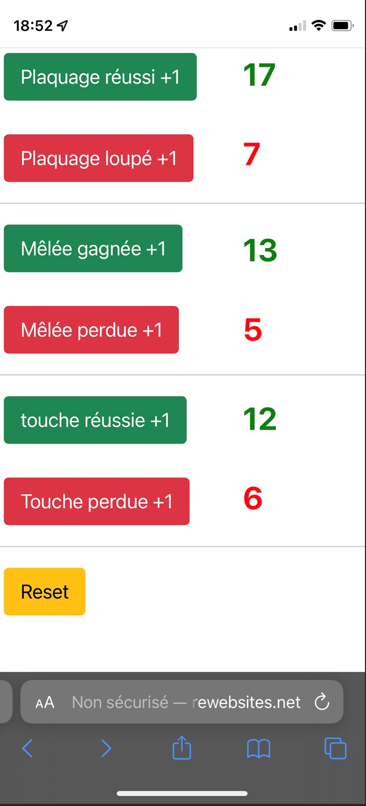

# Rugby-Stat-Live-App-Service
**Application pour les éducateurs ou entraineurs de Rugby :** 

  

C'est tout simple ! Cette application permet d'avoir les stats en direct ! 
Il suffit de donner l'URL de l'application à des parents de joueurs aux abords du terrain (Ex: Un qui suit les plaquages, un autre qui suit les mêlées et un autre qui suit les touches. Encore mieux un qui suit tout :-)) ... 
Les entraineurs et éducateurs ont toujours les informations en direct (mi-temps; quart-temps, ...) 

**Déploiement de l'application** 
Deux exemples de Workflows pour le déploiement dans Azure: 
1. **build_deploy_first.yml** 
  - Build une image Docker
  - Pousse l'image Docker dans une Azure Container Registry
  - Déploie un 'Resource Group', un 'App Service Plan', une 'App Service' avec le container de l'application et un 'Container registry Webhook' (Nouveau déploiement lorsque qu'il y a une nouvelle verion d'image dans Azure Container Registry)

2. **build_deploy.yml** 
  - Build une image Docker
  - Pousse l'image Docker dans une Azure Container Registry
  - Redéploie l'application dans la 'App Service' ('Container registry Webhook')

Au préalable une base MySQL est installée en service 'Managed' dans Azure ! 